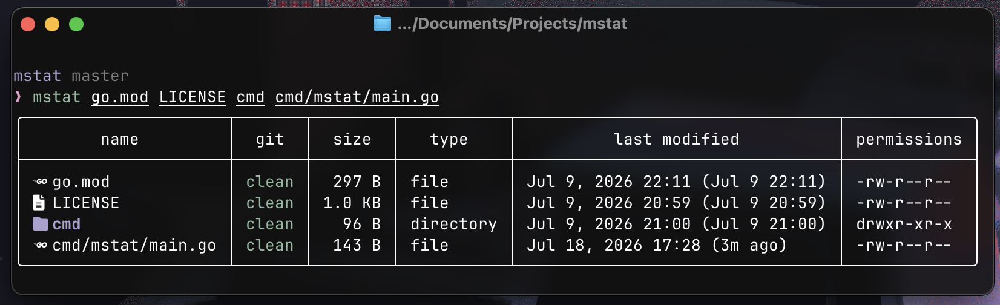

<div align="center">

# mstat

A modern stat alternative with beautiful bordered tables

[](https://go.dev/)
[](./LICENSE)
[](https://github.com/bhavya-dang/mstat/releases)



</div>

## Installation

### Prerequisites

- [Go 1.25+](https://go.dev/)
- Any [Nerd Font](https://www.nerdfonts.com/#home) (optional, for icons)

### Using brew

```bash
brew install bhavya-dang/mstat/mstat
```

### Using Go

```bash
go install github.com/bhavya-dang/mstat@latest
```

### Using Makefile

```bash
git clone https://github.com/bhavya-dang/mstat.git
cd mstat
make install
```

### Manual

```bash
git clone https://github.com/bhavya-dang/mstat.git
cd mstat
go build -o build/mstat ./cmd/mstat
cp build/mstat "$(go env GOPATH)/bin/mstat"
```

## Usage

```bash
mstat [file...] [flags]
```

## Flags

| Flag             | Short | Description                                |
| ---------------- | ----- | ------------------------------------------ |
| `--brief`        | `-b`  | Minimal output (name, size)                |
| `--extended`     | `-x`  | Extended output with all details           |
| `--no-icons`     | `-n`  | Disable Nerd Font icons                    |
| `--simple-icons` | `-s`  | Show only basic icons (folder, file, link) |
| `--version`      | `-v`  | Show version                               |

### View Modes

**Default:**
name | size | type | last modified | permissions

**Brief (-b):**
name | size | type

**Extended (-x):**
name | size | type | last modified | permissions | permissions octal | links

### Icons

By default, mstat shows language-specific icons for files (Go, Typescript, Python, etc.).
Use `--simple-icons` to show only basic icons (folder, file, link, etc.).
Use `--no-icons` to disable all icons.

### Colors

By default, directories and their icons will appear in ansi blue color. I am planning to make this configurable soon when configuration system is implemented.
This can be disabled using the `--no-colors` flag.

## Examples

```bash
mstat .
mstat go.mod main.go README.md
mstat -n LICENSE
mstat -x internal/
```

## License

MIT License

## Contributing & Issues

This is an open-source project. Feel free to contribute to existing issues or open a new one if you find anything!
