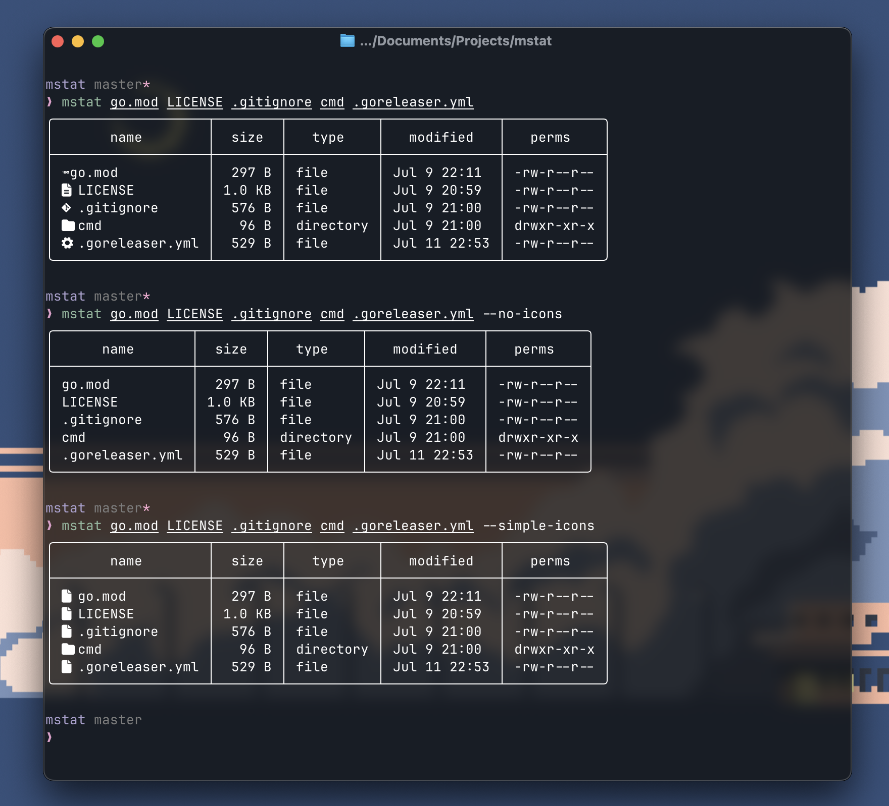

# mstat

A modern stat alternative with bautiful bordered tables



## Installation

### Prerequisites

- [Go 1.25+](https://go.dev/)
- Any [Nerd font](https://www.nerdfonts.com/#home)

### Using Go

```bash
go install github.com/bhavya-dang/mstat@latest
```

### Using Makefile

```bash
git clone https://github.com/bhavya-dang/mstat.git
cd mstat
make install
```

### Manual

```bash
git clone https://github.com/bhavya-dang/mstat.git
cd mstat
go build -o build/mstat .
cp build/mstat "$GOPATH/bin/mstat"
```

## Usage

```bash
mstate <arg1> <arg2> ...
```

## License

MIT License

## Contributing & Issues

This is an open-source project. Feel free to contribute to existing issues or open a new one if find anything!
