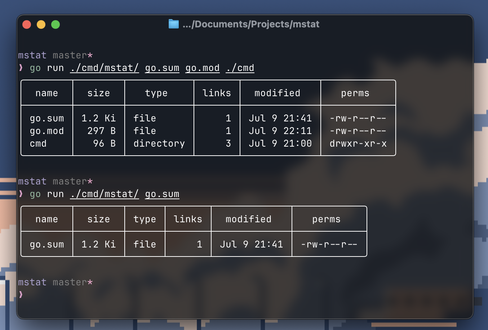

# mstat

A modern stat alternative with bautiful bordered tables



## Installation

### Using Go

```bash
go install github.com/bhavya-dang/mstat@latest
```

### Using Makefile

```bash
git clone https://github.com/bhavya-dang/mstat.git
cd mstat
make install
```

### Manual

```bash
git clone https://github.com/bhavya-dang/mstat.git
cd mstat
go build -o build/mstat .
cp build/mstat "$GOPATH/bin/mstat"
```

## Usage

```bash
mstate <arg1> <arg2> ...
```
